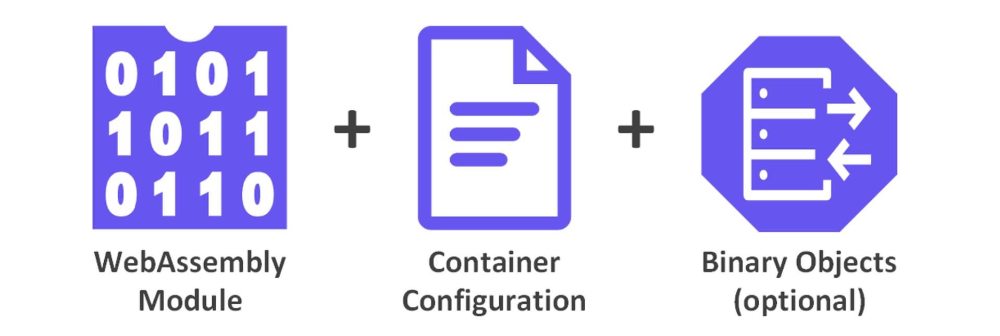

# Container Components

Atym containers are designed to bring cloud-native principles to embedded devices, combining efficiency with flexibility. Each container is a self-contained unit that encapsulates an application and its dependencies, structured to optimize performance and resource usage on constrained hardware.

An Atym container consists of **three** main elements, which are defined and organized within a **[Container Image Manifest](../container_image_manifest/)**:

- **[WebAssembly Module:](../components/webassembly_module/)** The core executable portion of the container, compiled from the developer's chosen language.
- **[Container Configuration:](../components/container_configuration/)** Metadata including the application name, execution properties, variables, and permissions.
- **[Binary Objects:](../components/binary_objects/)** Optional resources that can be referenced by the WebAssembly module. Examples include machine learning models, configuration files, or any other data needed by the application.