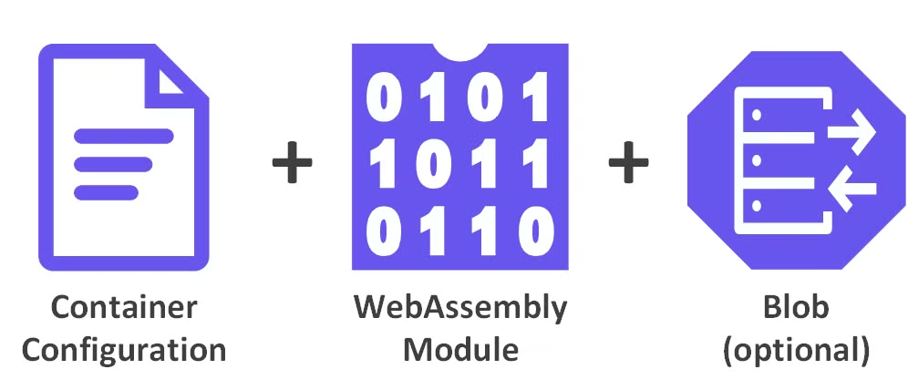

# Image Manifest

The Ocre Container Image Manifest (`application/vnd.oci.image.manifest.v1+json`) defines the structure and contents of an Ocre container. It provides a standardized way to organize, configure, and execute container elements within the Ocre runtime, providing configuration and layers for a single cohesive container image.

The manifest references **all** elements that comprise the container image. This includes the following elements:

* **Configuration**: Metadata defining container execution, including properties, variables, and permissions.
* **WebAssembly Module**: Standard WebAssembly executable code that runs in the container runtime.
* **Blobs** (Optional): Additional resources that can be referenced by the application, such as images, binary data, or AI/ML models.



---

## Manifest Structure
The manifest format follows the [OCI Image Manifest](https://github.com/opencontainers/image-spec/blob/main/manifest.md) specification, and while this format typically supports multiple architectures and operating systems, Ocre containers are fixed to the Wasi configuration. Additionally, every Ocre container must include a manifest file (`application/vnd.oci.image.manifest.v1+json`) with a matching `mediaType`.

### Example
```json
{
  "schemaVersion": 2,
  "mediaType": "application/vnd.oci.image.manifest.v1+json",
  "config": {
      "mediaType": "application/vnd.wasm.config.v0+json",
      "digest": "sha256:55a98fff5a9a7bef217678f2669ad89816875df55af51b6d1c23a5f9393234e3",
      "size": 196
  },
  "layers": [
      {
          "mediaType": "application/wasm",
          "digest": "sha256:71cb138990af165c4baf0c43361e5c055ed60a5d2632ee547597be56dcfa07e2",
          "size": 2397
      }
  ]
}
```

## Manifest Elements

Elements within the **manifest** are defined as follows:

| **Element** | **Type** | **Required** | **Description** |
|---------|------|----------|-------------|
| `schemaVersion` | int | Yes | Specifies the image manifest schema version; per the OCI Image Spec this MUST be `2` |
| `mediaType` | string | Yes | Specifies the type of this manifest file; for Ocre containers, this MUST be `application/vnd.oci.image.manifest.v1+json` |
| `config` | descriptor object | Yes | References the configuration object for this container image; schema follows the [OCI Content Descriptor](https://github.com/opencontainers/image-spec/blob/main/descriptor.md) schema; `mediaType` must be set to `application/vnd.wasm.config.v0+json` |
| `layers` | array | Yes | Specifies the list of elements that comprise this container image; each layer is a [descriptor](https://github.com/opencontainers/image-spec/blob/main/descriptor.md); one and only one layer MUST be of type `application/wasm` |


---

## Learn More
To understand how container configuration works in detail, see the [Image Configuration](../image_configuration) guide, which explains how metadata, environment variables, and execution parameters are defined for Ocre containers.