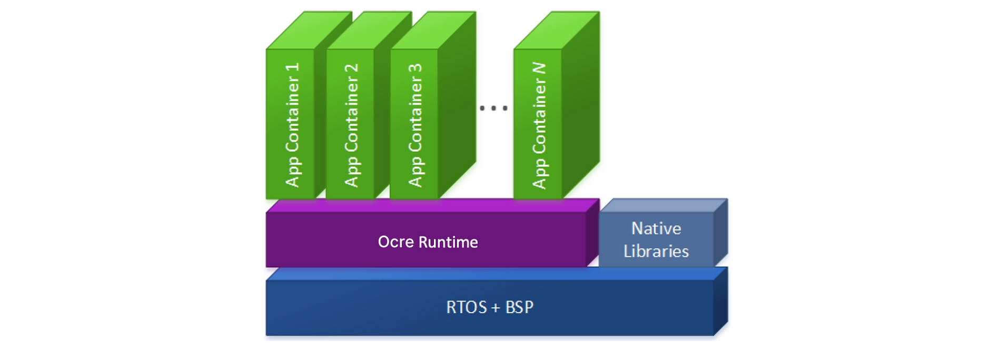

Atym containers are lightweight, portable environments that allow software to run consistently across different platforms. In the embedded world, Atym/Ocre containers bring the benefits of containerization to resource-constrained devices, revolutionizing embedded development. Atym containers (which are identical to [Ocre](https://lfedge.org/projects/ocre/) containers in function) enable developers to write applications in any language that can compile to WebAssembly, including C, C++, Rust, and more. This flexibility allows organizations to easily repackage existing C code into containerized apps, significantly simplifying management compared to monolithic firmware.

The containerized approach facilitates easier collaboration in embedded projects, allowing vendors to contribute modules without deep integration challenges. Moreover, containers provide enhanced security through virtualization, which is particularly crucial for tiny devices lacking hardware memory management units. Importantly, Atym containers offer these benefits while maintaining near-native performance, making them suitable for a wide range of embedded applications.