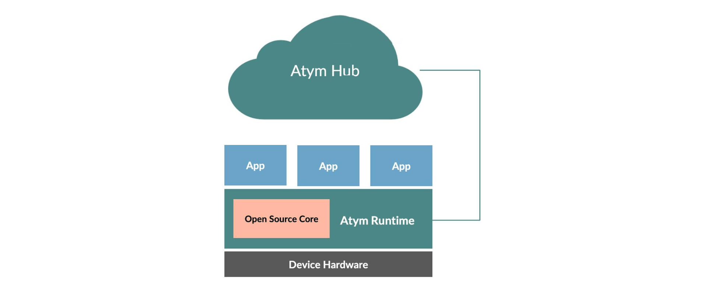

# Architecture

Atym's core architecture consists of two **primary** components.

- **[Atym Runtime:](../architecture/runtime/)** Installed on embedded devices, it serves as a stable base for container deployments. This commercially-supported version of the open-source [Ocre](https://lfedge.org/projects/ocre/) runtime provides a hardware abstraction layer and container runtime, working seamlessly with the Atym Hub. It allows developers to focus on building solutions rather than dealing with low-level device details.

- **[Containers](../architecture/containers/):** Lightweight, portable environments for running applications on embedded devices. Atym containers consist of a WebAssembly module, configuration metadata, and optional binary objects. 