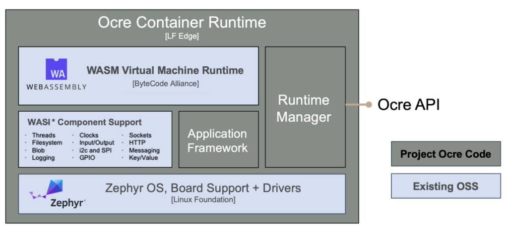

# Ocre Runtime

The Ocre Runtime enables containerization on resource-constrained devices through a combination of proven open-source technologies:

## Components

- **[Zephyr](https://zephyrproject.org)**: A mature RTOS providing comprehensive library support, modularity, and support for hundreds of platforms out-of-the-box with easy adaptation to new hardware.

- **[WebAssembly Micro Runtime](https://github.com/bytecodealliance/wasm-micro-runtime)**: Provides lightweight, sandboxed execution of containers through efficient virtualization.

- **[WASI Components](https://component-model.bytecodealliance.org/introduction.html)**: Implements the WebAssembly System Interface for embedded systems, enabling standardized system access.

- **Application Framework**: Manages container lifecycle, resource allocation, and inter-container communication for multi-container applications.

- **Runtime Manager**: Controls container deployment, updates, and monitoring across target devices.