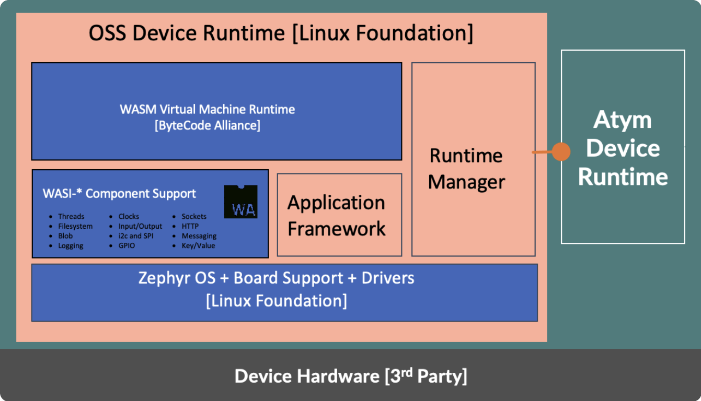

# Atym Runtime

The Atym Runtime is built upon the foundation of the [Ocre Runtime](https://lfedge.org/projects/ocre/), an entirely open-source initiative that provides the core functionality for running containerized applications on embedded devices. 

---

## Components

As illustrated in the diagram above, the runtime is composed of two main layers: the open-source Ocre components (in orange) and Atym's proprietary additions (in green).

### Ocre Components (Open-source)
- **[Zephyr](https://zephyrproject.org)**: Ocre is built on the Zephyr RTOS for its comprehensive library support, modularity, and active developer community. This choice enables support for hundreds of platforms out-of-the-box and easy adaptation to new or custom hardware.
- **[WebAssembly Micro Runtime](https://github.com/bytecodealliance/wasm-micro-runtime)**: Used as the virtualization layer, it allows for lightweight, sandboxed execution of containers on resource-constrained devices.
- **Runtime Manager**: Oversees the execution of WebAssembly containers on target devices.
- **Application Framework**: Supports multi-container embedded applications.
- **[WASI Components](https://component-model.bytecodealliance.org/introduction.html)**: Tailored implementations of the WebAssembly System Interface for embedded systems.
- **Hardware Abstraction Layer (HAL)**: Facilitates the "develop once, deploy anywhere" approach.

### Atym Components (Proprietary) 
- **Device Manager**: Manages the secure boot process, establishes connection with the Atym Hub, handles configuration updates, and maintains runtime integrity according to the manifest file. 
- **Container Supervisor**: Manages container lifecycles using a state machine approach. It oversees container creation, execution, and termination, interfacing with the Atym container runtime. 