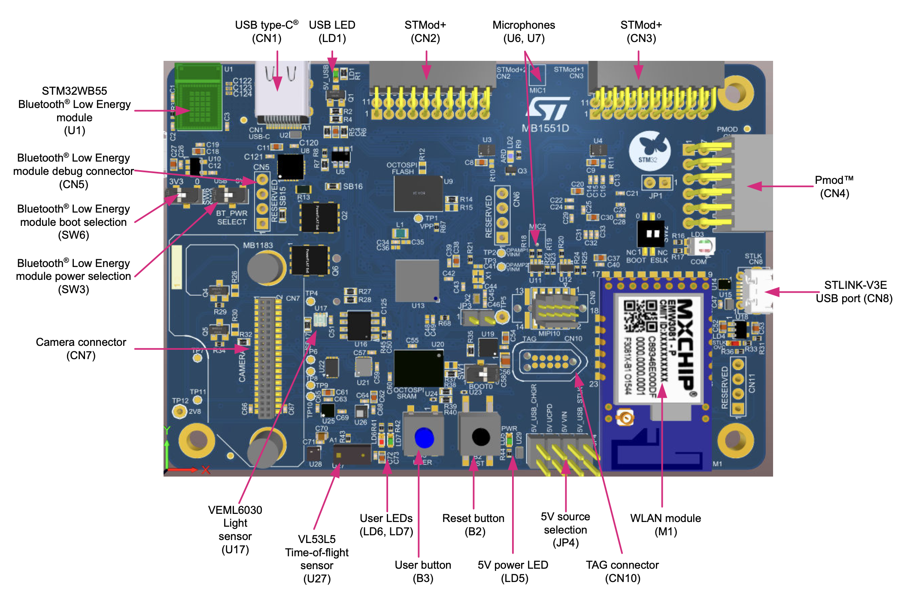

# B-U585I-IOT02A Discovery Board

---

## Overview

The **STM32 B-U585I-IOT02A Discovery Board** is a versatile IoT development platform built around ST Micro's STM32U585AI microcontroller. This board combines ultra-low-power operation with advanced security features, making it ideal for developing IoT, wearable, and sensor applications.

Key features include:
* Arm® Cortex®-M33 processor with TrustZone® security
* 2 MB Flash memory and 786 KB SRAM
* Wi-Fi® (802.11 b/g/n) and Bluetooth® Low Energy connectivity
* Rich sensor array:
 * 3D accelerometer and gyroscope
 * Temperature and humidity sensor
 * Digital barometer
 * Time-of-flight and gesture detection
* Multiple expansion options via ARDUINO® Uno V3, STMod+, and Pmod™ connectors
* Integrated STLINK-V3E debugger with USB connectivity

In the diagram below, you can see many of the board's physical components:

---

## Connecting to the Device

### Physical Connection
The board has two micro-USB ports. Connect a micro-USB cable to the port labeled **STLINK-V3E USB port (CN8)** in the top right corner of the board. Once connected, power and debug LEDs should illuminate, indicating the board is ready for use.

### Serial Connection
To monitor your device's output:
1. Open your preferred serial terminal application 
2. Configure the following settings:
  * **Port**: Select the port where your device is connected
  * **Baud Rate**: 115200
  * **Data Bits**: 8
  * **Parity**: None
  * **Flow Control**: None
  * **Line Endings**: None

{: .note}
The device will appear as a USB serial port when properly connected. On Linux/macOS it will typically be `/dev/ttyACM0` or similar, on Windows it will be a COM port.

---

## Building and Flashing the Ocre Runtime.

To build and flash the Ocre runtime to your board, please follow the steps in the [Using a Physical Device](../../../quickstart/firmware/hardware) section found in the [Building and Flashing the Ocre Runtime](../../../quickstart/firmware) guide. 

{: .note}
Be sure to use `b_u585i_iot02a` as your board name.

---

## Rebooting the Device

You may reboot the device by pressing the black button once.

---

## Resetting the Device to Factory Defaults
To erase all stored data and reset the board to its factory default state:

1. Open STM32CubeProgrammer
2. In the port dropdown menu, select "ST-LINK". Click the refresh icon next to "Serial Number", select your device, and click the green "Connect" button
3. Select "Full chip erase" from the left sidebar (eraser icon)
4. Click "OK" to confirm
5. A dialog box will confirm successful flash memory erasure
6. Click the green "Disconnect" button to free up the port for future flashing and debugging

**Note**: This will erase all stored data including WiFi credentials and installed applications.

---

## Important Links

For additional details about the board and development tools, please refer to the following resources:

* **Product Page**: [https://www.st.com/en/evaluation-tools/b-u585i-iot02a.html](https://www.st.com/en/evaluation-tools/b-u585i-iot02a.html)
* **User Manual**: [https://www.st.com/resource/en/user_manual/um2839-discovery-kit-for-iot-node-with-stm32u5-series-stmicroelectronics.pdf](https://www.st.com/resource/en/user_manual/um2839-discovery-kit-for-iot-node-with-stm32u5-series-stmicroelectronics.pdf)