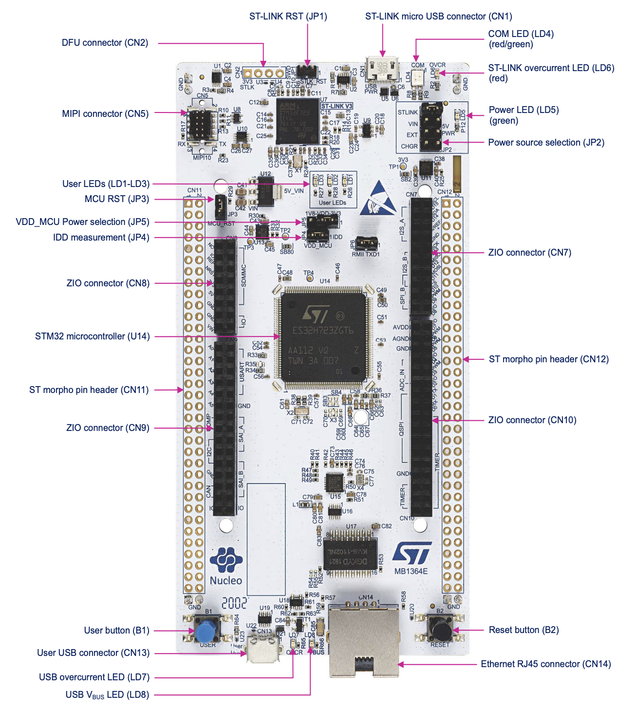

# NUCLEO-H723ZG Development Board Overview

## Overview
The **STM32 NUCLEO-H723ZG Development Board** is a high-performance platform built around ST Micro's STM32H723 microcontroller. This board features the powerful Arm® Cortex®-M7 core making it ideal for computationally intensive applications requiring real-time processing.

Key features include:
* Arm® Cortex®-M7 processor running at up to 550 MHz
* 1 MB Flash memory and 564 KB SRAM
* ST-LINK/V3E embedded debug tool
* Ethernet connectivity support
* USB OTG ports
* Arduino Uno V3 connectivity
* ST morpho expansion pins
* Three ST Zio connectors
* Flexible power supply options:
 * ST-LINK USB VBUS
 * USB power supply
 * External sources

## Powering the Device
Connect the board using the USB connector (CN1) labeled **USB PWR/ST-LINK**. The PWR LED (LD3) should illuminate, indicating the board is powered.

## Rebooting the Device
Press the black NRST button to reboot the device.

## Resetting the Device to Factory Defaults
To reset the board to its factory state and clear any stored applications:
1. Hold the blue USER button (B1)
2. Press and release the black NRST button
3. Keep holding the blue button until the LED blinks
4. Release the blue button

## Important Links
For additional details about the board and development tools, please refer to the following resources:

* **[Product Page](https://www.st.com/en/evaluation-tools/nucleo-h723zg.html)**: Official product information and resources
* **[User Manual](https://www.st.com/resource/en/user_manual/um2407-stm32h7-nucleo144-boards-mb1364-stmicroelectronics.pdf)**: Board documentation and technical specifications