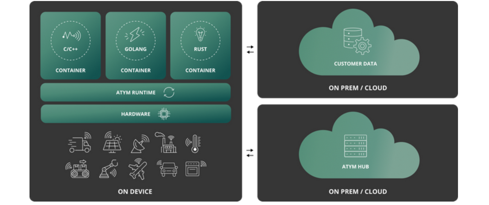

Ocre is a SaaS-based infrastructure solution that extends containerization to billions of resource-constrained edge devices, breaking past the "Linux barrier" to enable containerized applications on devices with as little as 1MB of memory. It brings cloud-native principles and OCI-like containerization to embedded devices, allowing developers to build, deploy, and manage modular applications across a wide range of connected products.

Traditionally, updates on embedded devices have been risky and complex, requiring specialized tools like cross-compilers and unit test tools. Ocre simplifies this process by leveraging [Zephyr RTOS](https://zephyrproject.org/), [WebAssembly](https://webassembly.org/), and its custom runtime. With Ocre, developers can create containers using their preferred language, allowing for flexibility and accelerating the deployment of modular applications in secure, platform-independent containers. This approach reduces risk and enables safer, more frequent updates to edge devices.