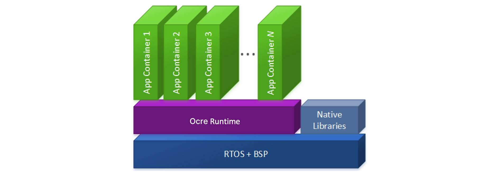

Ocre leverages [WebAssembly](https://webassembly.org/) and the [Zephyr RTOS](https://zephyrproject.org/) to enable OCI-like application containers on embedded devices — with a footprint up to 2000x lighter than Linux-based container runtimes such as Docker. Ocre's mission is to revolutionize how applications are developed, deployed, and managed for the billions of constrained edge devices in the field, spanning sensors, cameras, controllers, IoT gateways, machines, robots, drones, autonomous vehicles and beyond.

Traditionally, updates on embedded devices have been risky and complex, requiring specialized tools like cross-compilers and unit test tools. Ocre simplifies this process through WebAssembly's platform independence and sandboxed execution environment, combined with Zephyr's real-time capabilities and broad hardware support, all orchestrated by its custom runtime. 

With Ocre, developers can "lift and shift" traditional embedded C/C++ code into containers and deploy additional containerized apps alongside them using their preferred programming language (e.g., GoLang, Rust). This approach not only reduces risk and enables safer, more frequent updates but also helps organizations re-use code, prevent silicon lock-in, increase security posture, protect their IP, and manage large fleets of devices and apps in the field.