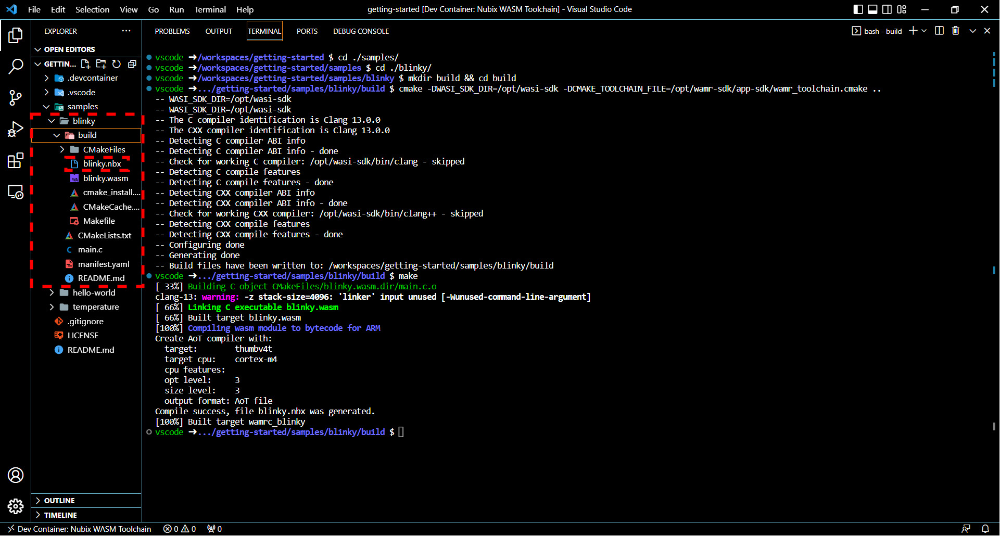

# Blinky Sample

The Blinky sample demonstrates how to build and deploy a simple Ocre container that allows you to interact with device hardware, namely flashing an LED. This is a good introduction to understanding how Ocre containers can perform basic I/O operations.

---

## Building the Blinky sample

The following steps will guide you to build the blinky sample.

1. Move into the `blinky` directory (found in `samples`).
```
cd blinky
```

2. Next, build the blinky sample using the following commands:
```
mkdir build && cd build
cmake -DWASI_SDK_DIR=/opt/wasi-sdk -DCMAKE_TOOLCHAIN_FILE=/opt/wamr-sdk/app-sdk/wamr_toolchain.cmake ..
make
```

This will create a container image called `blinky.nbx` that we can then deploy to our device.  



---

## Deploying the Blinky sample
The following steps will guide you to deploy the blinky sample to your device.

1. To deploy the blinky sample, simply run the following in your terminal:
```
example code
goes here
```