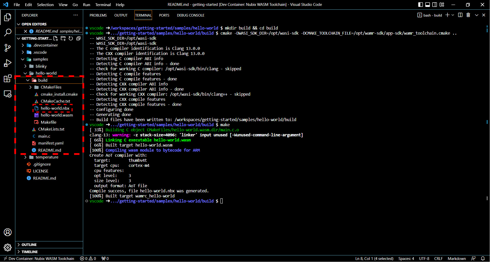

# Hello World Sample

The Hello World sample demonstrates the basic structure of an Ocre container, introducing you to the core components of Ocre's development environment. This page will guide you through the steps to build and deploy the Ocre container, helping you get familiar with Ocre's containerized application process.

---

## Building the Hello World Sample

The following steps will guide you to build the Hello World sample.

1. Move into the `hello-world` directory (found in `samples`).
```
cd hello-world
```

2. Next, build the hello world sample using the following commands:
```
mkdir build && cd build
cmake -DWASI_SDK_DIR=/opt/wasi-sdk -DCMAKE_TOOLCHAIN_FILE=/opt/wamr-sdk/app-sdk/wamr_toolchain.cmake ..
make
```

**Note:** This will create a container image called `hello-world.nbx` that we can then deploy to our device.  



---

## Deploying the Hello World Sample
The following steps will guide you to deploy the hello world sample to your device.

1. To deploy the hello world sample, simply run the following in your terminal:
```
example code
```